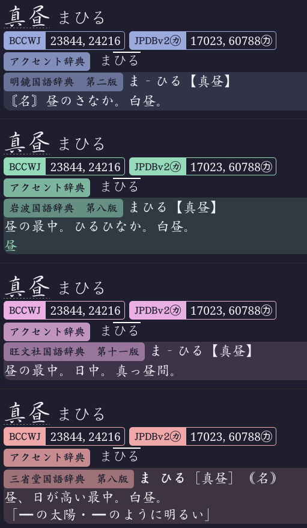

## Styling for [Yomitan](https://yomitan.wiki/).

### Light Mode:

### Dark Mode:

### Dictionaries Used:
- 明鏡国語辞典
- 岩波国語辞
- 旺文社国語辞典
- 三省堂国語辞典
- 新選国語辞典
- 漢検漢字辞典
- 新明解国語辞典

### Yomitan Settings:

#### Appearance
- **Font size**: 16
- **Line height**: 1.25
- **Compact glossaries**: ✅
- **Compact tags**: ✅
- **Term display style**: Plain term and reading
- **Reading mode**: ひらがな
- **Frequency display style**: Split tags, grouped content
- **Selection indicator style**: None
- **Pitch accent display styles**: ✅ Downstep notation

#### Result Display
- **Result grouping mode**: No grouping
